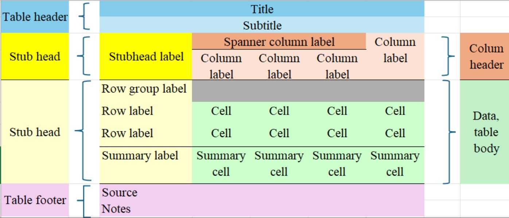

# Tables

*Tables* form a key component regarding how agencies disseminate statistics from household survey data. Using tables efficiently helps minimize the amount of numeric values presented within the text, and to organise the survey results for presentation to the users and wider audiences. It is therefore important to discuss some core principles and ideas to the preparation and production of tables with survey results.

Before we enter detailed discussions, it is important to distinguish three main types of tables that can be used for presenting the results of a survey:

-   presentation tables;

-   reference tables;

-   long / database like tables.

The guidelines for each of these kinds of tables will be somewhat different, though all three types should follow some key principles, as suggested by Miller (2004), namely:

-   **Principle 1.** Make it easy for your reader to find and understand the numbers presented in your tables;

-   **Principle 2.** Draw the layout and labels of the table in a simple and direct way, helping to focus attention on the results you want to show.

## Presentation tables

These are generally small tables, used to highlight certain key results obtained from the survey, to be presented in press releases, executive summaries, scientific articles or reports, or on landing web pages which contain the survey output. They are not expected to provide all results on a topic, but rather to highlight key results that should draw the attention of a reader to some of the main stories the data have produced.

In presentation tables, the data should be presented concisely, and organized to support the text with the analysis of the corresponding data. They should be designed in such a way to help readers learn about the key results on the topic provided by the survey.

Short, well-designed and formatted tables can provide a lot of information that readers can absorb quickly. This applies to tables published in any vehicle: reports, press releases, articles, electronic publications or websites. The example below illustrates the idea.

Presentation tables should have rows (and possibly columns) sorted in a way that helps the reader perceive patterns, such as high or low figures. Such tables will often sacrifice detail in exchange for readability and understanding. Numbers should be presented with no more than 3 or 4 digits altoghether. If they area population counts, use thousands. If the figures are percentages, use no more than a single decimal digit, or even present only percentages rounded to the nearest integer, if the precision of the estimates do not warrant providing decimals (e.g. margins of error larger than 1%).

## Example of presentation table and corresponding text - include in a box.

Among middle and senior managers, women are outnumbered at all ages. The underrepresentation of women was observed in all age groups. Relative to their share among non-managers, women were outnumbered among middle and senior managers. In all age groups, women accounted for about 4 in 10 middle managers and 3 in 10 senior managers.

Table 2 - Share of women (%) by age group and occupation

|   Age group    | Non-managers | Middle managers | Senior managers |
|:--------------:|:------------:|:---------------:|:---------------:|
| 25 to 34 years |     44.6     |      40.3       |      28.4       |
| 35 to 44 years |     45.7     |      38.7       |      31.3       |
| 45 to 54 years |     48.3     |      40.5       |      31.7       |

Note: The category "women" includes women, as well as some non-binary people. Source: Statistics Canada, Census of Population, 2021. <https://www150.statcan.gc.ca/n1/pub/36-28-0001/2024010/article/00005-eng.htm>

## Reference tables

These are longer tables, generally used to present more complete sets of results from statistical studies. They should be limited in size to something that could be contained in a few pages of a printed report, say, with a number of rows no larger than 200, and no more than say 12 columns. Anything bigger than that should be considered for dissemination as a *database like table*, probably available only for download from a website or readable from some digital media.

Reference tableswill typically take core classification, domain definition or *explanatory* variables to define the rows, and have the *outcome* classification or output variables define the columns. In both directions, sorting should typically be such that it is easier for the readers to locate the data that they are most interested in, either using alphabetic or well known classifications.

Reference tables have in many cases been replaced by access to interactive databases that allow the interested user to obtain the tables they want from a website.

Tables (of all types) should be *self-sustaining*. The idea is that each table should have the necessary metadata, so that if copied from one location to another it still makes sense. If you can get your tables to be *self-sustaining*, they will be easier to understand correctly, either in or out of the original context.

Anatomy of a table. Figure XX presents the essential components of a table.

{fig-align="center" width="50%"}

The title (and optional subtitle) of a table must provide a clear and precise indication of the data that will be presented in the table. These elements, combined, must answer the questions about what, where and when regarding the data to be presented inside the table. Be concise and avoid using verbs.

Column header elements should identify the data that is displayed in each column of the table. They must also provide much of the relevant metadata: unit of measurement, time period, geographical area, etc.

Stub elements, provided as the first column in the table, should identify the data that is displayed in each row of the table.

The source of the data must always be provided at the bottom of the table, and must indicate the organization responsible and the name of the survey or study that produced the results contained in the table. The omission of the citation of the source prevents the reader from seeking more information about the data presented, and should be avoided.

The Notes are optional, but they can be used to provide additional details about the data as needed to understand and use it correctly. Avoid using long texts, which if needed, would be better placed in a document that is then cited in the Notes section. If there is more than one Note, number sequentially, and use the numbers to indicate the corresponding calls inside the table. Make sure that the calls to Notes are sufficiently distinct from the actual figures / numbers inside te table to avoid confusion.

The Data is the most important piece of information that the user expects to get from the table. Therefore, it is essential to present them in a way that is easy to extract the relevant information. For some tables, depending on the message you want to convey, it may be easier to search for information by rows or columns. This should be the most important consideration when deciding whether to present the table in portrait or landscape orientation. Dividing lines, dotted lines, shading, and even spacing can be helpful in guiding the reader to read the table in the 'right' direction.

Some basic rules for presenting the data include:

-   Use similar spacing for columns whenever possible;
-   Avoid any unnecessary text;
-   The width of the table should be only the width necessary to present the data, and not the entire width of the available space;
-   Time series data should be presented in chronological order – for reference tables, in ascending order; for presentation tables, this order can be reverse or descending to display the most recent data first;
-   Data on categorical variables should be presented using standard classifications; in reference tables, categories should be ordered according to the standard classification; in presentation tables, they can be presented in (descending) order of frequency to highlight the most frequent categories first;
-   Use as few decimal places as possible;
-   Use thousands separators; space is a better separator because it does not vary with the decimal separator according to language;
-   Always align the numbers to the right, ensuring that the decimal separator (comma or period, depending on the language) are aligned;
-   Never center the values unless they all have the same number of digits;
-   Do not leave blank cells on the table; missing values or 'not applicable' situations must be identified with an appropriate symbol;
-   Round the data to units that make sense in each case; aim for providing 3 or 4 significant digits in presentation tables;
-   Rounding is also useful when the data is not very accurate, but be careful not to lose precision.

The recommendations provided here to reference tables should also apply to longer tables provided as databases, but these can have additional resources if they are embedded on websites. For example, there may be support for users to sort tables using the values in each column, which would be useful for large tables where the user may be looking for the higher (or lower) values in a given column.

## Dealing with Suppression of Low-Quality Estimates

National Statistical Offices routinely produce descriptive statistics, such as totals, averages, proportions, and ratios, based on survey data. These statistics provide valuable insights into key characteristics of the population, such as income levels, employment rates, or access to education. To ensure this information reaches a wide audience, NSOs often use a variety of dissemination channels, including:

- **Public Reports**: Comprehensive reports summarizing key findings from household surveys.
- **Online Platforms**: Interactive data visualization tools and downloadable datasets on official websites.
- **Press Releases**: Brief summaries of major findings designed to capture public and media attention.

These dissemination efforts aim to make the data understandable and actionable for policymakers, researchers, and the general public. When publishing tables of results, NSOs strive for clarity and usability. Tables are typically organized to highlight trends, comparisons, and distributions of key variables. Common features of published tables include:

- **Aggregated Data**: Grouping data by categories like age, gender, region, or socioeconomic status.
- **Confidence Intervals**: Including measures of uncertainty to provide context for the estimates.
- **Metadata**: Offering detailed explanations of the data collection methods, definitions, and limitations.

By presenting data in a user-friendly format, NSOs ensure their publications are accessible to a diverse audience.

Not all estimates derived from survey data meet the necessary quality standards for publication. Estimates may be suppressed if they are based on small sample sizes, have high variance, or are otherwise unreliable. NSOs use established criteria to determine when suppression is necessary, ensuring that the released data maintains its credibility. To address this issue we can use the following approaches:

1. **Quality Thresholds**: NSOs set predefined thresholds for measures like the coefficient of variation (CV) or standard errors.
2. **Flagging and Suppression**: Estimates that fall below these thresholds are either flagged with warnings about their reliability or omitted entirely from published tables.
3. **Transparency**: NSOs provide clear documentation explaining why certain estimates are suppressed, maintaining transparency and trust.

