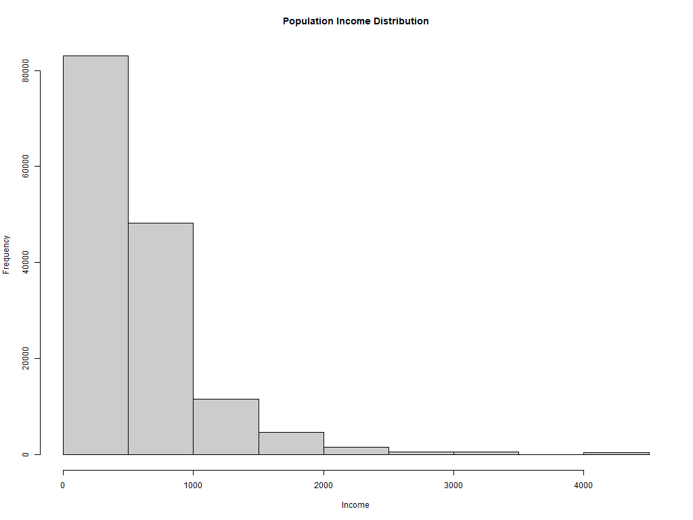
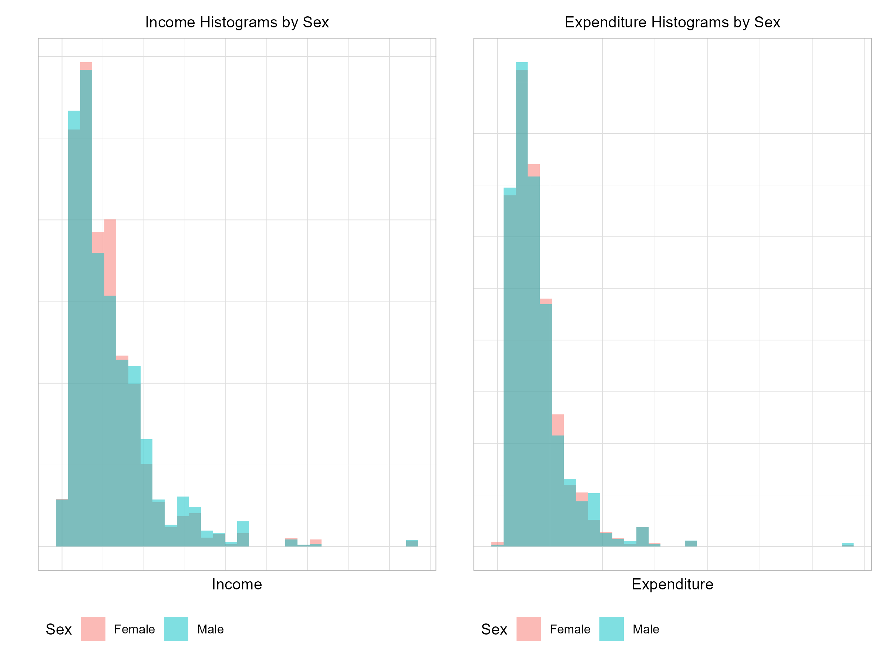
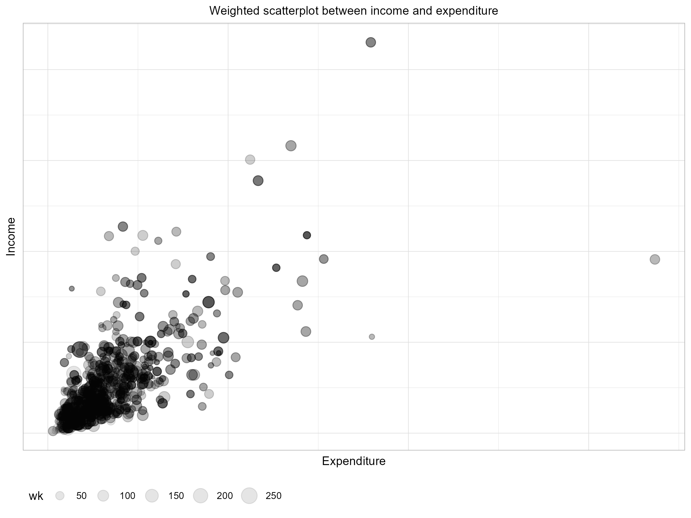

# Data visualization

In this section we discuss how to present data and estimates resulting from household surveys using graphics. Effective graphs can reveal patterns, trends, and relationships in the data, making it easier to interpret findings and communicate them to diverse audiences. While standard plots can still be used to show distributions and associations from the raw (unweighted) sample data, these can be misleading for the corresponding population distributions and associations. Therefore it is recommended that modified plots that account for survey weights be used instead. 

For example, a bar chart showing income distribution should incorporate weights to properly represent the income distribution for the entire population. Similarly, scatter plots exploring associations between variables should use weighted markers or density adjustments to ensure the relationships are accurately depicted. In addition, regarding the display of survey estimates, which are subject to sampling error, it is important to convey this message by presenting not only point estimates, but also standard errors or confidence intervals.

When presenting survey estimates, it is essential to recognize that these estimates are subject to sampling error. To effectively communicate this uncertainty, graphs should include measures such as standard errors or confidence intervals. For instance:

- Confidence intervals can be added to bar charts or line graphs to show the range of plausible values for an estimate.
- Error bars in scatter plots can illustrate the variability associated with specific data points.

Incorporating these elements into visualizations helps ensure that viewers understand the inherent uncertainty in the survey estimates, fostering more informed interpretations. When the survey units have different sampling weights, these should be taken into account when preparing graphs with their data. The main reason is that weights can be interpreted as the number of population units that each sample unit represents. Hence, it is evident that unequal weights need to be considered in the elaboration of graphs based on such sample data.

When graphs are created without considering weights, the visual representation reflects the sample characteristics rather than the population. This discrepancy can distort distributions, proportions, or relationships between variables. Incorporating weights ensures that the graphs provide a more accurate representation of the population.

## Bar charts

When the data of interest are categorical, their descriptive analysis will be done using contingency tables. Bar charts are commonly used to visualize categorical data. For survey data, descriptive analysis of categorical variables typically begins with contingency tables that summarize weighted counts or proportions. These tables can then be used to create bar charts, ensuring the results reflect population-level characteristics rather than just sample data. Ideally one should also aim to display error lines overlaying bars to indicate their respective confidence interval widths, thus conveying the uncertainty of the corresponding point estimates. Obtaining the weighted counts or proportions and their confidence intervals can be easily done using tools from several software packages, e.g. the `survey` package in R.

As an example, the bar chart presents a comparison of the number of individuals (`Nd`) between rural and urban zones, with error lines indicating the confidence intervals for each estimate. According to the values in the table, the urban zone shows a slightly higher `Nd` value than the rural zone, with 78,164 individuals in the urban area compared to 72,102 in the rural area. This difference suggests a higher concentration of people in the urban zone.

The confidence intervals allow us to assess the precision of these estimates. In the rural zone, the confidence interval ranges from 66,039 to 78,165 individuals, while in the urban zone, the confidence range goes from 72,526 to 83,802 individuals. This overlap between the intervals indicates that, although the urban zone has a higher number of individuals, the difference is not pronounced enough to be statistically significant.

Furthermore, the standard deviation of `Nd` is 3,062 for the rural zone and 2,847 for the urban zone, reflecting similar variability in both zones. This suggests that the estimates are consistent in terms of relative uncertainty, without major differences in data dispersion between the zones.

(\#fig:barIncome)Distribution of Population Income

| Zone  | Number of Individuals (Nd) | Standard Error (Nd_se) | Lower Limit (Nd_low) | Upper Limit (Nd_upp) |
|--------------|----------------|--------------|--------------|--------------|
| Rural | 72,102                     | 3,062                  | 66,039               | 78,165               |
| Urban | 78,164                     | 2,847                  | 72,526               | 83,802               |

: Population distribution by area

## Histograms

Histograms serve to present the distribution of a single numeric (continuous) survey variable or response. If one had a census, then the histogram is a powerful tool to describe the underlying distribution, even for very large datasets. When displaying sample data, however, the sampling weights must be taken into account when estimating frequencies or relative frequencies of population units having values in the specified histogram bins. Modern survey analysis tools can easily provide weighted histograms where the sampling weights are incorporated.

Histograms are often seen as precursors to density function estimates. A density estimate can be thought of as a histogram with a large number of bins, providing a smoother view of the data distribution. The `survey` package in R includes functionality for plotting smoothed density estimates that account for sampling weights, offering a more detailed representation of the population.

A common example of visualization in this type of analysis is the use of histograms to represent the distribution of variables such as income. These charts allow us to observe the distribution of the variable of interest in the expanded population and to understand its shape, dispersion, and general trends.

It is also common to perform graphical analyses broken down by subgroups, such as geographic areas (urban and rural) or thematic characteristics like gender (male and female). This approach helps identify key differences among specific population subgroups, for instance, by examining income distribution in men and women over the age of 18. Such breakdowns help visualize and communicate potential gaps between subgroups of interest.

In this way, charts help to communicate results in an accessible manner, offering a clear and straightforward visual representation for audiences who may not be familiar with the technical details of estimation methods.

In \@ref(fig:histIncome) the horizontal axis (x) represents income levels, spanning from 0 to over 4000 monetary units, while the vertical axis (y) indicates frequency, meaning the number of individuals within each income range.

The distribution shows that most of the population is concentrated at lower income levels, with a particularly high frequency near 0. As income levels rise, frequency declines sharply, indicating a right-skewed (positively skewed) distribution with a smaller proportion of people at higher income levels. The light gray bars visually emphasize this concentration at lower incomes, highlighting a significant disparity in the population's income distribution.

(\#fig:histIncome)Distribution of Population Income

As an example, Figure \@ref(fig:HistIncomeExpenditureSex) presents two histograms illustrating the distribution of income and expenditure by sex. In the histogram on the left, titled "Income Histograms by Sex," we observe the income distribution, where blue bars represent men and pink bars represent women. The majority of the population, both male and female, is concentrated in the lower income levels, showing a right-skewed distribution. In the lower income levels, there are more men than women, while at higher income levels, the difference is less pronounced.

In the histogram on the right, titled "Expenditure Histograms by Sex," the distribution of expenditure is shown, also broken down by sex. Similar to income, most of the population of both sexes is concentrated in the lower expenditure levels, with a right-skewed trend. There is also a higher proportion of men in the lower expenditure levels, while at higher levels, the representation between sexes is more balanced. These histograms exemplify the similarity in the income and expenditure distributions between men and women, although men appear to be slightly more represented in the lower levels of both variables.

(\#fig:HistIncomeExpenditureSex)Histograms of Income and Expenditure by Sex

Histograms, especially when weighted for survey design, are invaluable for exploring and presenting the distribution of continuous variables. Subgroup analyses further enhance their utility, enabling the identification of disparities and trends across different population segments. Combined with smoothed density estimates, histograms provide a comprehensive and accurate view of the population's numeric variables.

## Scatter Plots

Scatter plots are the tool of choice to explore relationships between two continuous variables, potentially revealing patterns or trends in the data. These plots face the two challenges discussed above. First one needs to try and convey in the plot that the different sample observations carry different weights. For small to moderate sample sizes this can be done by plotting circles or dots of varying sizes where the symbol size represents the corresponding observation sampling weight. Plots like these can be obtained using standard bubble plot tools or the scatter plot available in the `survey` package in R. As stated by @Lumley2010, when dealing with large datasets, displaying all the data points in a scatter plot can be overwhelming and cluttered. Several strategies can help address this issue:

1. **Subsampling**: Select a smaller, manageable subsample from the full dataset. The subsample should be selected with probabilities proportional to the sampling weights, ensuring that it behaves approximately like a simple random sample from the population. The resulting scatter plot maintains representativeness while being easier to interpret. The subsample obtained in this way behaves approximately as a simple random sample from the survey population.

2. **Hexagonal Binned Scatter Plots**: Divide the plot area into a grid of hexagons. Instead of plotting individual points, represent each hexagon with shading or size based on the total sampling weights of the points within that hexagon. This approach condenses the data into a clear and interpretable visualization. With complex household survey data, the number of points in a hexagonal bin should be replaced by the sum of the weights for points in the bin.

3. **Smoothed Scatter Plots**: Avoid plotting individual points altogether and instead estimate and display trends. For example, calculate specific quantiles (e.g., quartiles) of the y-axis variable conditioned on the x-axis variable and smooth these values across the range of the x-axis. This approach highlights trends while minimizing visual clutter.

The figure \@ref(fig:ScatterIncome), illustrates the weighted relationship between income and expenditure in a population. In this plot, the size of the points represents the weight assigned to each observation. A high concentration of points is observed at lower income and expenditure levels, suggesting that most of the population has low income and low expenditure.

Although there is an upward trend, indicating that income and expenditure tend to increase together, the dispersion of points reveals that higher expenditure is not always associated with proportionally higher income. Some larger points, corresponding to observations with greater weight, are distributed across different levels of income and expenditure without concentrating in a single area. Additionally, a few isolated points at high expenditure levels may represent outliers with considerably higher-than-average expenditure. Overall, this plot suggests a positive relationship between income and expenditure, accompanied by significant variability and some exceptional cases.

(\#fig:ScatterIncome)Weighted scatterplot between income and expenditure

Scatter plots are a versatile and effective way to explore relationships between variables in survey data. By incorporating sampling weights and adopting strategies to manage large datasets, they can provide clear, meaningful insights into population-level patterns. Whether using weighted points, hexagonal binning, or smoothing techniques, scatter plots remain a cornerstone of data visualization for continuous variables.

## NSO -- Practical example

In this subsection we will include the experience of a NSO on displaying information through graphics.
